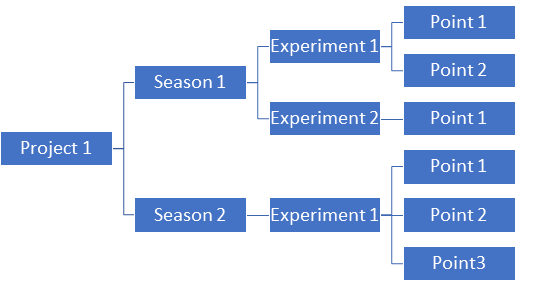

Back End
============================================

This explain main construction of backend.

The code is object oriented and contain 5 classes interconnected as shown in the figure,
and have the following fuction:

* Project
* Seasson
* Experiment
* Point
* Time_interval: defines time and all of the above contain this class

The data is stored as following:

insert image data storage

