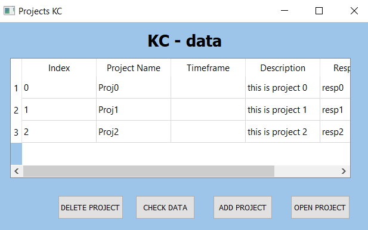
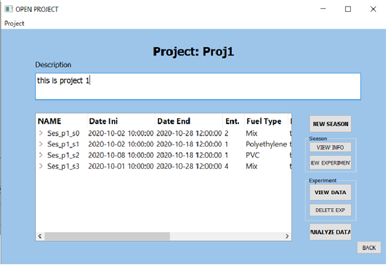
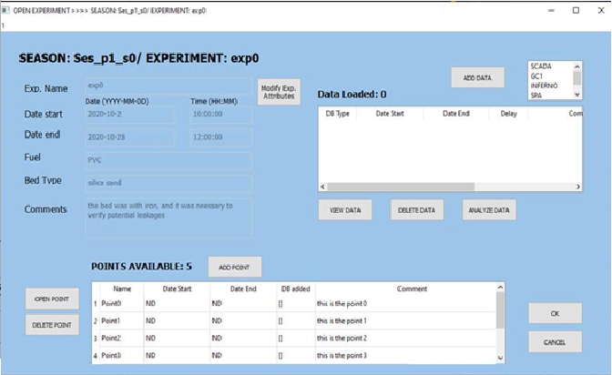

Graphic Interface
============================================

This explain main construction of the graphic interface.

**Main Window**

It is the start window and has a table with all the projects available. It can *open a project* or *add a project*

**Project Window**

Allows the modification of a project including:

	- Adding a *New Season*
	- *View info* of a Season
	- Adding a *New Experiment*
	- *View data* of an existing Experiment	
	- *Delete* a Experiment

**Experiment Window**

Allows the modification of a Experiment including:

	- *Open Point*
	- *Add Point*
	- Adding a SCADA, GC or SPA data (*Add data*)

**Point Window**

In progress

